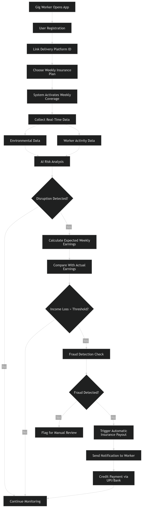

"# devtrails" 

Problem Statement

India’s gig economy has rapidly expanded with millions of delivery partners working for platforms such as Zomato, Swiggy, and Amazon. These workers depend entirely on daily or weekly earnings to sustain their livelihoods. However, their income is highly sensitive to external environmental disruptions such as extreme rainfall, severe heatwaves, high pollution levels, floods, or sudden weather changes. When such conditions occur, delivery demand may drop or workers may be unable to work for long hours due to safety risks. As a result, gig workers often lose a significant portion of their weekly income without any financial safety net. Traditional insurance products are not designed to cover income disruptions caused by environmental conditions, leaving gig workers financially vulnerable. Therefore, there is a need for a specialized insurance system that can automatically detect environmental disruptions and compensate workers for the income they lose during such events without requiring manual claims.

Solution

The proposed solution is an AI-powered parametric micro-insurance platform specifically designed for gig workers that automatically provides compensation when environmental conditions negatively affect their ability to work. Instead of traditional claim-based insurance, the system uses real-time environmental data, AI-based earning prediction models, and platform activity data to estimate whether a worker’s income has been disrupted due to external factors. The platform continuously monitors parameters such as rainfall intensity, temperature extremes, and air quality levels, and compares expected weekly earnings with actual earnings during those conditions. When predefined thresholds are exceeded, the system automatically triggers a payout to the worker. To make the system practical for gig workers, the pricing model operates on a weekly subscription basis with very small premiums that align with their weekly earnings cycle. Additionally, AI-driven fraud detection mechanisms analyze location data, delivery activity patterns, and historical behavior to ensure that payouts are legitimate and not manipulated.

Persona

Consider a delivery partner named Ravi, a 26-year-old gig worker living in a metropolitan city who works for multiple platforms to maximize his earnings. Ravi typically earns between ₹3500 and ₹5000 per week depending on the number of deliveries he completes. During normal weeks, he works long hours and manages to maintain a stable income. However, during extreme weather conditions such as heavy rains or severe heatwaves, Ravi’s working hours decrease significantly because roads become unsafe or customer demand drops. In such weeks, his earnings can fall by almost 30%, which directly impacts his ability to pay rent, bills, and daily expenses. Ravi needs a simple financial protection system that does not require complicated paperwork or claim processes. He prefers a system that automatically protects his weekly income and charges a very small amount that he can afford regularly.

Flow Chart

